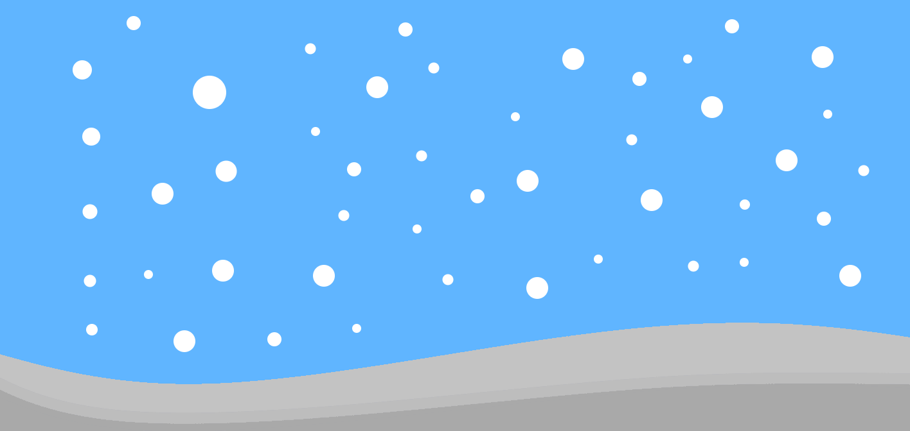
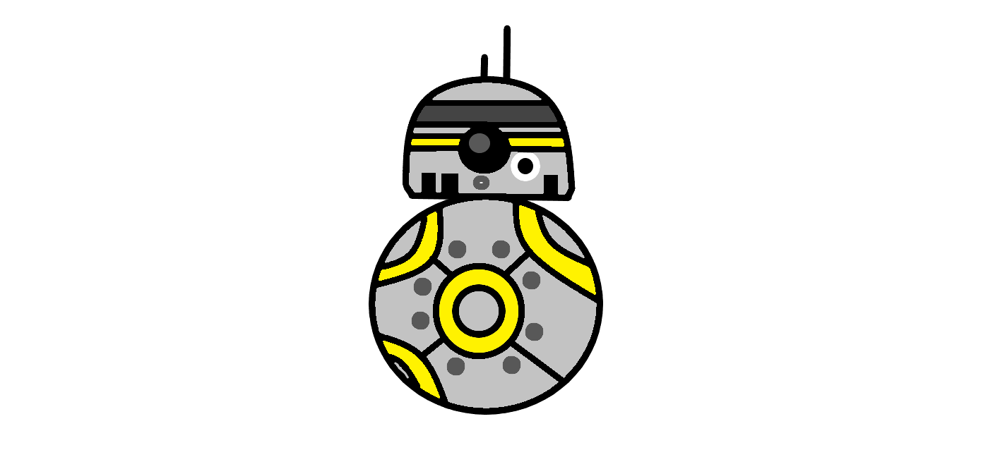
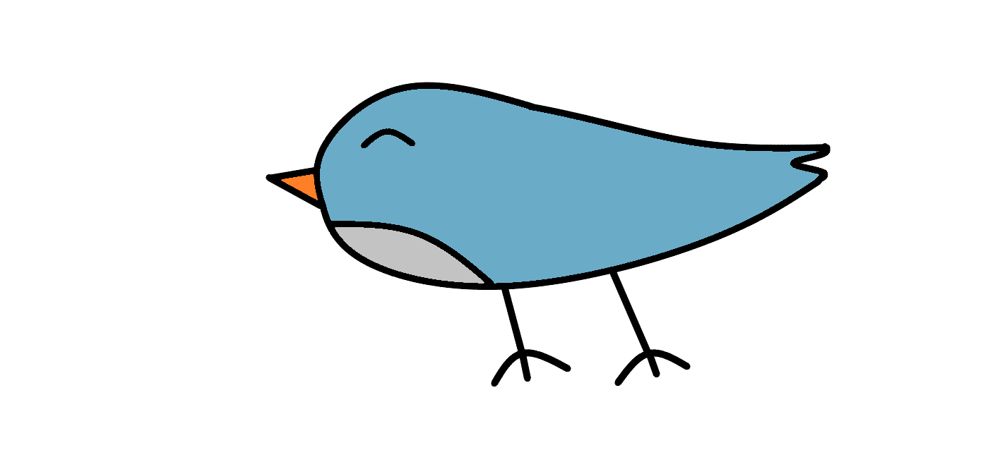
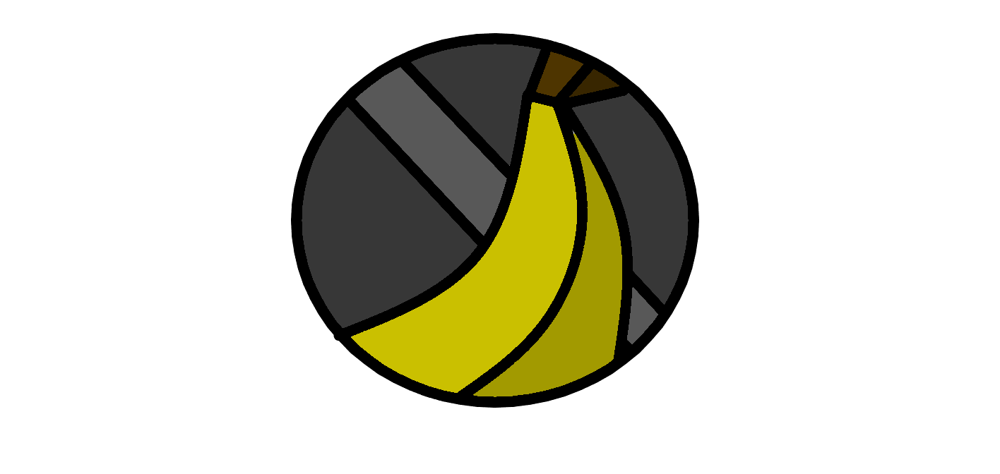
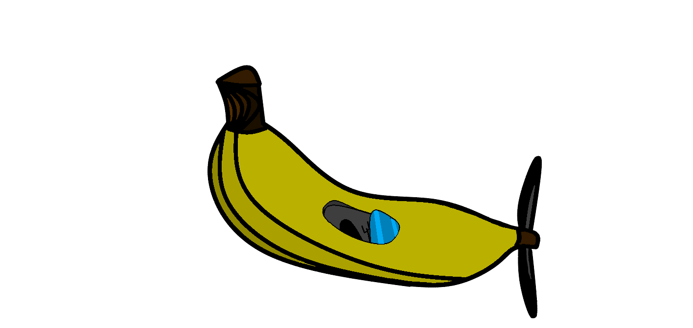

  <h1>moving-background</h1>
  
  

  <h1>tipbot</h1>
  
  

  <h1>static-background</h1>
  
  

  <h1>donations</h1>
  
  

  <h1>water</h1>
  
  

  <h1>ground</h1>
  
  

  <h1>obstacle</h1>
  
  

  <h1>flavor1</h1>
  
  

  <h1>flavor2</h1>
  
  

  <h1>flavor3</h1>
  
  

  <h1>banana</h1>
  
  

  <h1>monkey</h1>
  
